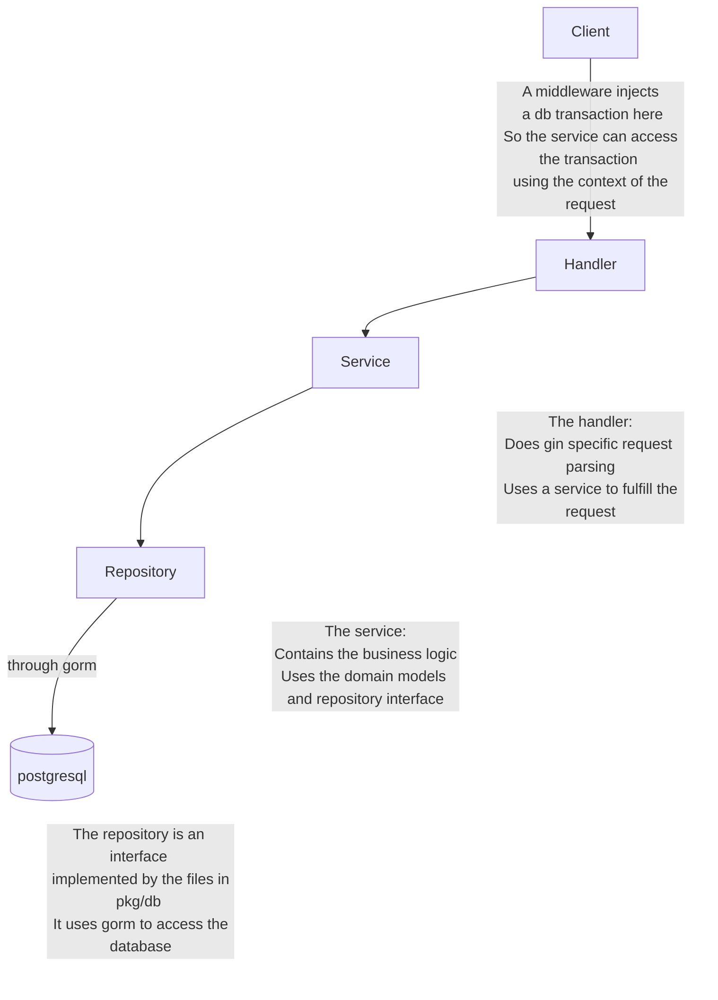

# go-starter

## TODO

- ✅ Create users with email
- ✅ log in with email
- ⬜ Handle sessions with middleware:
- access token (short lived and stateless) 
- refresh token (long lived and saved hashed in db) 
- Hash the Refresh Token 
- tokens saved in two seperate HTTP-only, Secure cookies (preferably SameSite=Strict or Lax)
- both cookies sent in each request
- 🚀 1. High-Level Flow (Server-Side Auto-Refresh)
  Step-by-Step Flow: 
  Client makes an API request (HTMX or standard fetch). 
  Server validates the access token: 
  If valid → processes the request as usual. 
  If expired: 
  Checks for a valid refresh token (sent via HTTP-only cookie). 
  If the refresh token is valid: 
  Issues a new access token (and optionally rotates the refresh token). 
  Fulfills the original request without sending an error to the client. 
  Sends the new access token in an HTTP-only cookie along with the response. 
  If the refresh token is invalid/expired: 
  Responds with 401 Unauthorized (or 403 Forbidden). 

- ⬜ Sign up with google and apple
- ⬜ Login with different providers

Access token and refresh tokens are now being created when log in.
Need to create them when signing up
Need to implement middleware that checks whether logged in or not
Revoke session if no cookie found

## Tech Stack

This project functions as a starter for any webapp. It uses the stack

- Gin Web Framework
- HTMX
- Typescript
- Tailwind CSS

For Bundeling, Minifying and Compiling TS to JS I use Webpack.
It also uses Docker. There is a make file which starts the whole stack in development and production mode.

## Backend architecture

We will follow an MVP architecture for better separation of concerns.
This is the request's life cycle.

