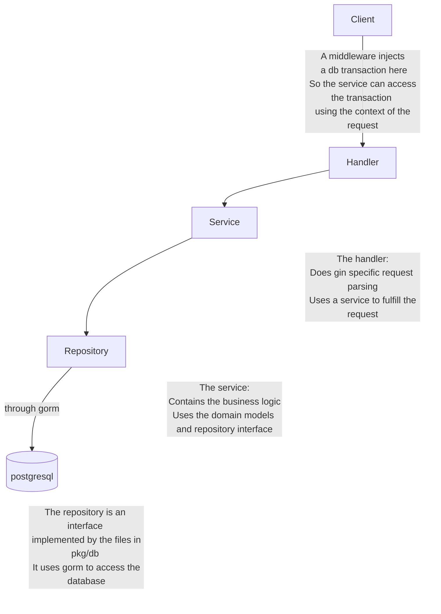

# go-starter

## TODO

- ✅ Create users with email
- ✅ log in with email
- ✅ Handle sessions with middleware
- ✅ Log out functionality
- ⬜ Add redirects if not able the autheticate user
- ⬜ Polish Code
- ⬜ Signup with google and apple
- ⬜ Login with google and apple

## Tech Stack

This project functions as a starter for any webapp. It uses the stack

- Gin Web Framework
- HTMX
- Typescript
- Tailwind CSS

For Bundeling, Minifying and Compiling TS to JS I use Webpack.
It also uses Docker. There is a make file which starts the whole stack in development and production mode.

## Backend architecture

We will follow an MVP architecture for better separation of concerns.
This is the request's life cycle.

